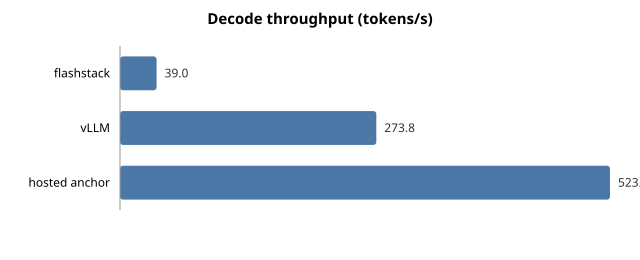

# 📊 Agent Benchmark: Three Backends, One Task Suite

**The short version:** I built a FlashAttention CUDA kernel expecting it to make inference fast. I then measured where the time actually goes. The kernel turned out to control about **1.5%** of the decode speed. The other 98.5% is the CPU struggling to keep the GPU fed.

This report shows the measurements that led to that conclusion.

---

## 🎯 What was tested

The same AI agent ran the same 20 tasks against three different backends. Nothing changed between runs except the server address and the model name.

Think of it as three different engines bolted into the same car, driven around the same track.

| Backend | What it is |
|---|---|
| **flashstack** | My engine, my CUDA kernel, running locally |
| **vLLM** | The industry-standard fast serving engine, same GPU, same weights |
| **hosted anchor** | A commercial API running a much bigger model — a reference point, not a fair fight |

Everything ran at temperature 0, so the models behave as deterministically as possible.

### Test environment

| | |
| :-- | :-- |
| GPU | NVIDIA GeForce RTX 3090 |
| Driver | 580.126.09 |
| CUDA (torch) | 13.0 |
| PyTorch | 2.11.0+cu130 |
| flashstack commit | `224f69c` |
| flash-attention-cuda commit | `91c091e` |
| Suite | 20 tasks over the Halden Systems (fictional) corpus |

---

## 📈 Results

| backend | model | success | calls/task | retries | TTFT p50 (ms) | decode (tok/s) | task p50 (s) | task p95 (s) | cost/task |
| :-- | :-- | --: | --: | --: | --: | --: | --: | --: | --: |
| flashstack | `Qwen/Qwen2.5-0.5B-Instruct` | 15% (3/20) | 6.8 | 20 | 101 | 39.0 | 9.4 | 13.6 | 0.00092 |
| vLLM | `Qwen/Qwen2.5-0.5B-Instruct` | 10% (2/20) | 3.7 | 20 | 24 | 273.8 | 0.5 | 1.9 | 0.00007 |
| hosted anchor | `llama-3.3-70b-versatile` | 100% (20/20) | 3.0 | 0 | 234 | 523.4 | 1.3 | 3.3 | 0.00137 |

### What each column means

- **success** — how many of the 20 tasks the agent actually completed correctly
- **calls/task** — how many times the agent had to call the model to finish one task
- **retries** — times the model returned malformed output and had to be asked again
- **TTFT p50** — median time to first token: how long you stare at a blank screen before text appears
- **decode** — tokens generated per second once text starts flowing
- **task p50 / p95** — median and worst-case (95th percentile) time to finish a whole task
- **cost/task** — money spent per task, in dollars

### 💰 A note on the cost column

Cost is **not one number measured two ways.** The two kinds of backend are billed on completely different principles:

- **Local backends** (flashstack, vLLM) rent a GPU by the hour. Cost = wall-clock GPU time at **$0.35/hour**. You pay for the clock, whether the GPU is working or idle.
- **Hosted backend** bills per token. Cost = token usage the API itself reports, at **$0.59 per million input tokens** and **$0.79 per million output tokens**.

Same currency, different accounting. Comparing them directly is fair only if you keep that in mind.

---

## 🧩 Per-tier breakdown

Tasks were grouped by how much reasoning they require. This is where the small model's limits show up.

| backend | single-tool | two-tool | multi-step (4+ calls) |
| :-- | --: | --: | --: |
| flashstack | 1/8 | 2/8 | 0/4 |
| vLLM | 2/8 | 0/8 | 0/4 |
| hosted anchor | 8/8 | 8/8 | 4/4 |

The 0.5B model gets nothing right once a task needs four or more chained tool calls. The 70B hosted model gets everything right. That is a **model size** result, not a serving result.

---

## 🔍 Where the numbers come from

Every published latency and throughput figure is a **client-side stream measurement** — a stopwatch running in the benchmark client, started when the request is sent and stopped when the first chunk arrives. The same stopwatch, the same way, on all three backends.

| backend | streamed | TTFT p50 source | decode tok/s source | server cross-check |
| :-- | :-- | :-- | :-- | :-- |
| flashstack | yes | client-stream | client-stream | 66 ms from final-chunk (135 calls) |
| vLLM | yes | client-stream | client-stream | none reported |
| hosted anchor | yes | client-stream | client-stream | none reported |

### Why the cross-check column exists

flashstack reports its own internal timing via an `x-ttft-ms` header. The other two backends don't. So it can never go in the results table — you can't compare a number only one contestant produces.

But the difference between the two is itself worth knowing:

| | flashstack TTFT |
| :-- | --: |
| What the server thinks | 66.5 ms |
| What the client actually waits | 101.4 ms |
| **Difference** | **34.9 ms (1.53×)** |

That 34.9 ms is the real, measured cost of packaging the answer up and shipping it: JSON encoding, SSE event framing, and pushing bytes through the loopback socket.

The server stops its clock the moment the first token exists. The client can't start reading until that token has been serialized, wrapped, and transmitted. **Published TTFT is the client number** — because that's what a caller actually waits for, and because it's the only definition all three backends can supply.

---

## ⚖️ How retries and throttling are counted

Two different things can make a backend issue more calls than a task needs. They're counted differently because they *cost* differently.

**Parse retries — billed work, counted in full.**
The model returned something that wasn't a valid action object. The agent sent one corrective message and the backend generated again. Those extra calls appear in `calls/task`, their tokens appear in the token counts, and their latency stays inside the task timings.

> A backend that formats badly *should* look more expensive, because it is.

**Throttle waits — not work, subtracted out.**
A hosted endpoint refused the request before serving it. Nothing was computed, nothing was billed. That waiting time is measured and reported separately, then subtracted from task latency and from the run's wall clock.

> Leaving it in would charge a local backend's GPU-hour rate for time spent sleeping, and would make a rate-limited hosted API look computationally slow when it was only queued.

---

## 📉 Charts

---

# 🔬 Where the 7× gap actually comes from

vLLM decodes at **273.8 tok/s**. flashstack decodes at **39.0 tok/s**. Same GPU, same weights, same task. That's a **7.0× gap.**

Three explanations are usually offered for a gap like this. Only one of them explains *this* gap — and the measurements say which.

---

## Cause 1: Host dispatch overhead — enough on its own ✅

### The idea

A GPU doesn't decide what to do. The CPU tells it, one operation at a time. Every one of those instructions has to be prepared in Python: look up the attribute, allocate the tensor, check the arguments, issue the launch.

**An analogy:** imagine a chef who can chop a vegetable in under a second, but has to walk to the pantry and back for each one. The chopping isn't the problem. The walking is.

### The measurement

An Nsight Systems trace of decode steps ([`docs/profiles/decode_dispatch.md`](../../docs/profiles/decode_dispatch.md)) found the GPU:

<b>6% busy · 94% idle</b>

| | |
| :-- | :-- |
| GPU operations issued per token | ~1,388 |
| Duration of each operation | ~2.8 µs |
| Host-side gap between operations | ~79 µs |

The GPU spends the overwhelming majority of decode **waiting for its next instruction.**

### What that implies

If dispatch were free — if the same GPU work were issued back to back with no gaps — flashstack would decode at:

<b>651 tok/s — 16.7× its measured rate</b>

That ceiling is **2.4× beyond vLLM's measured 273.8 tok/s.**

So dispatch overhead alone *more than* accounts for the entire 7.0× gap. Nothing else needs to be invoked to explain it.

> That doesn't mean nothing else is true. It means nothing else is *required*.

---

## Cause 2: Continuous batching — contributes nothing here ⬜

### The idea

Continuous batching lets a server slot new requests in between decode steps, instead of making them wait for the current batch to finish. It's a genuine and significant advantage of vLLM.

### Why it doesn't apply

This benchmark never gives it the chance. The agent is **strictly sequential** — one request in flight at a time, always. There is never a second request waiting to be admitted.

vLLM's scheduler is running exactly the same single stream flashstack's is.

<b>Contribution to this gap: 0×</b>

This is the right answer for a *served deployment under concurrent load.* It explains none of the gap measured **here**, and citing it would mean borrowing an explanation from a workload this report never ran.

---

## Cause 3: Attention kernel quality — capped at ~1.5% ⬜

This is the uncomfortable one, since the custom kernel is the centerpiece of the whole project.

### The measurement

From the kernel repository's own nsys traces, at sequence length 1024:

| | |
| :-- | --: |
| Decode attention cost per layer per token (split + merge) | 15.9 µs |
| Layers in Qwen2.5-0.5B | 24 |
| **Total attention per token** | **0.38 ms** |
| Measured total time per token | 25.6 ms |
| **Attention's share of decode wall clock** | **~1.5%** |

### What that implies

Make attention **infinitely fast** — zero cost, instantaneous — and flashstack goes from:

<b>39.0 tok/s → about 39.6 tok/s</b>

The hand-written kernel this entire project is built around is worth **at most 1.5%** of the number it is most often assumed to control.

---

## 📋 Adding it up

| cause | contribution to this gap |
| :-- | :-- |
| **Host dispatch overhead** | Sufficient alone — a 16.7× ceiling against a 7.0× gap |
| **Continuous batching** | 0× — the workload is sequential |
| **Attention kernel quality** | ≤ 1.5% of decode wall clock |

### The honest reading

This comparison measures **how fast Python can issue kernel launches.** It does not measure how good the attention kernel is.

That is the finding — and it is the opposite of what the project set out expecting. The kernel work is real, measured, and correct. The serving gap it sits inside is dominated by everything around it.

### What would actually move the number

All three of these attack the **launch count**, not attention:

| change | what it does |
| :-- | :-- |
| **CUDA graphs** | Record a launch sequence once, replay it instead of re-issuing every step |
| **Operator fusion** | Fewer, bigger kernels doing the same work |
| **Paged KV cache** | More concurrent sequences per byte of memory → higher achievable batch size |

None of them is about attention. All are out of scope for this stage by instruction.

### For completeness

The Phase-1 profiles show the **prefill kernel reaching roughly a third of this card's fp32 FMA peak**, and the **decode kernel reaching up to 27% of DRAM peak.**

Respectable in isolation — and, as the decomposition above shows, almost irrelevant to the end-to-end figures here.

---

## ⚠️ What the success column does and does not say

Success rate here is a property of **Qwen2.5-0.5B-Instruct**, not of the serving stack.

Two backends running identical weights at temperature 0 should agree closely. Where they don't (15% vs 10%), the difference is sampling and numerics — not capability. Neither engine is "smarter" than the other.

The column is included for two reasons:

1. **Success rate drives cost.** A failed task still burns every call it made.
2. **A large divergence would be a bug.** If two backends on identical weights disagreed sharply, that would itself be a finding worth chasing.

---

  <a href="../../docs/writeup.md">Full write-up</a> ·
  <a href="../../docs/profiles/decode_dispatch.md">Dispatch profiling</a> ·
  <a href="../../docs/kernel.md">Kernel design</a> ·
  <a href="../../docs/benchmark.md">Benchmark methodology</a>

