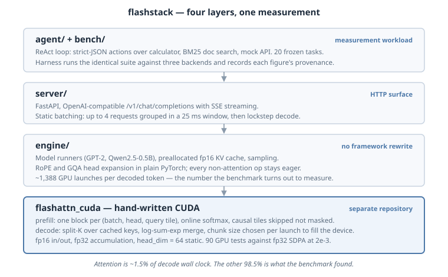

# Architecture

FlashStack is two repositories with one dependency direction, four layers with one
job each, and a single design rule: **only the attention math is custom; everything
else is deliberately boring**, so that when the benchmark says where time goes, the
answer is attributable to one variable.



## The two repositories

| Repo | Role | Ships |
|---|---|---|
| [flash-attention-cuda](https://github.com/shrvan30/flash-attention-cuda) | Pure kernel library | `flashattn_cuda.prefill()` / `.decode()` as a pip-installable PyTorch extension |
| **flashstack** (this repo) | The application | engine, server, agent workload, benchmark harness |

flashstack depends on the kernel via pip; the kernel knows nothing about
flashstack. That direction is why the kernel repo has its own tests, CI, and
version history — it is a component, not a subfolder.

## The four layers

```
Layer 4  agent/    ReAct loop + 3 tools + frozen 20-task suite   -> generates realistic multi-call traffic
Layer 3  server/   FastAPI, OpenAI schema, SSE, static batching  -> talks to the outside world
Layer 2  engine/   model runners, KV cache, sampling             -> runs GPT-2 / Qwen2.5-0.5B
Layer 1  kernel    flashattn_cuda (separate repo)                -> the attention math on the GPU
```

Each layer only calls the one below it. The benchmark (`bench/`) sits beside the
stack, not inside it: it drives any OpenAI-compatible endpoint — this server,
vLLM, or a hosted API — through the identical workload, which is what makes the
comparison meaningful.

## One request, end to end

```
HTTP POST /v1/chat/completions (OpenAI JSON)
  -> server/app.py           parse + validate (server/schemas.py), set up SSE
  -> server/scheduler.py     queue -> batch of <=4 within a 25 ms window
  -> engine/models/*.py      ModelRunner.prefill() once, then decode_step() per token
  -> engine/kv_cache.py      append this token's K,V row into the preallocated cache
  -> flashattn_cuda.decode() split-K attention over the cache        <- the custom kernel
  -> engine/sampling.py      greedy / temperature / top-p
  -> tokenizer -> SSE chunk -> client
```

Prefill is the same path with the whole prompt at once, calling
`flashattn_cuda.prefill(causal=True)`.

## Design principles, stated once

- **One variable under study.** Attention runs on the custom kernel; layernorm,
  MLP, embeddings stay stock PyTorch. Any behavioural difference between the
  patched and stock models is therefore the kernel's.
- **Boring interfaces at every seam.** OpenAI's chat schema at the top,
  HuggingFace models in the middle, two plain functions at the bottom. Every seam
  is swappable, which is how the same harness benchmarks three backends.
- **Measurement is a first-class subsystem.** Metrics carry provenance labels end
  to end (see [benchmark.md](benchmark.md)); the report refuses figures whose
  meaning it cannot state.
- **Honest ceilings.** The stack does not implement continuous batching, paged KV,
  or CUDA graphs — and the headline finding is precisely the cost of their
  absence, measured: decode is host-dispatch-bound at ~6% GPU utilisation
  ([profiles/decode_dispatch.md](profiles/decode_dispatch.md)).

## Where things live

```
engine/   patching.py (GPT-2 swap) · models/{base,gpt2,qwen25}.py · kv_cache.py · sampling.py
server/   app.py · scheduler.py · schemas.py
agent/    loop.py · tools/{calculator,doc_search,mock_api}.py · corpus/ (10 docs) · tasks.json
bench/    run.py · metrics.py · scoring.py · report.py · results/
docs/     writeup.md · architecture.svg · this folder
```

Deep dives: [engine.md](engine.md) · [server.md](server.md) ·
[kernel.md](kernel.md) · [benchmark.md](benchmark.md) · [faq.md](faq.md)
